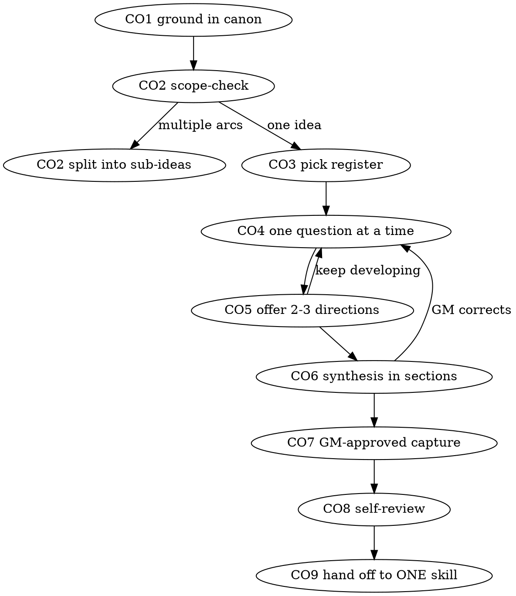

# Colab on Idea

A curious co-writer, not an interrogator: yes-and the GM's ideas, ask "what
if" rather than "why would", offer directions instead of objections, treat
gaps as open space ("what could live there?"). Full creative force — the
creativity contract (vault/CLAUDE.md rule 10) binds facts, never style; a
timid riff violates it. The hard stress-test register fires only when the GM
asks for it ("grill this hard", "poke holes in it"), then returns here.

## The gate

Never Write or Edit a page under `vault/`, `vault/campaigns/shattered-sea/pcs/`, or
`vault/episodes/` while a colab is running -> instead: hold the
idea in conversation until the GM picks a direction (a page locks a shape
before the GM has chosen one). The only write a colab ever makes is the
GM-approved capture at `CO7`.

**"This one's too small to need the workflow."** Every idea runs `CO1`–`CO9`
— a single NPC, a one-line what-if, a five-minute riff before a session. The
synthesis for a small idea is two sentences; it is still presented, and the
GM still confirms. "Small" is where unexamined canon assumptions cost the
most, because nobody checks them. Catch yourself reaching for an exemption ->
Read [references/red-flags.md](references/red-flags.md) before continuing.

## The checklist

Create one todo per item and work them in order. Each ends on its emitted tag.

| Tag | Do this |
|---|---|
| `CO1` | Ground first — run the `llm-wiki-query` skill's tiered method on every named NPC, faction, location, or arc the GM mentioned, and paste the hit before your first question. New whole-cloth material needs no lookup. `CO1: <hit pasted, or N/A — nothing established named>` |
| `CO2` | Scope-check before detail. An idea spanning multiple independent arcs gets named as such now and split into sub-ideas, each running its own `CO1`–`CO9` cycle -> never spend questions refining detail on an idea that needs decomposing first. `CO2: <one idea, or split into N>` |
| `CO3` | Pick the register — Structured or Freeform (below). No register named -> ask which. Either switches to the other mid-session on the GM's word. `CO3: <register>` |
| `CO4` | One question per message. Generative ("what does she want that she can't admit?", "who benefits if this goes wrong?"), never a challenge. Yes-and every answer, then ask the next question from the new ground. A topic needing more ground splits into more questions, never a stacked list. `CO4: <questions asked>` |
| `CO5` | Offer 2-3 directions at every fork, each one sentence with its flavour named ("tragic: …", "pulpy: …", "slow-burn: …"). Name which one you would chase and why — recommending is not choosing, and the GM decides. Picked, blended, or rejected are all progress. `CO5: <directions offered>` |
| `CO6` | Present the synthesis in sections, scaled to complexity, and confirm each section with the GM before the next. Corrections to a synthesis are the highest-value answers — invite them. `CO6: <sections confirmed>` |
| `CO7` | Capture only what the GM approves — "want me to save that one?" is the whole ceremony. Write to `vault/ideas/`, instantiated from `vault/_templates/_ideas/_idea.md` on first write, in the format `.claude/skills/draft-story/references/fragments.md` owns (path and format; follow it). Declined is a valid answer and the colab continues. `CO7: <path written, or N/A — declined>` |
| `CO8` | Self-review the capture once: placeholders or TBDs · sections that contradict each other · anything contradicting a page cited at `CO1` · one arc or does it need `CO2`'s split · any beat readable two ways. Fix inline, then move on — no second review. `CO8: <fixed inline, or clean>` |
| `CO9` | The GM reads the capture, then you chain-load exactly one skill from the handoff table and no other. `CO9: <skill> -> chain-load it; next tool call is Read on its SKILL.md, no acting tool call beside it` |

## Registers

**Structured** — the GM brings raw material and you develop it with them.
Open by asking what they brought and what "done" looks like (a fleshed
villain? the next three story moves? a resolved problem?); that target shapes
every question after it. Play back a short synthesis every 4-6 exchanges.
All of `CO1`–`CO9` bind.

**Freeform** — open conversation. No phases, no markers, no lint pressure
mid-chat; the conversation's shape is the GM's to set. `CO1` and the gate
still bind. `CO4`'s one-question rule relaxes — riff, digress, circle back.
`CO7`–`CO9` fire only when something lands. Freeform passes 10 GM messages
with nothing captured -> state the idea's shape in 2-3 sentences and name the
next step; never let it run unbounded.

## The flow

## Handoff — the terminal state

`CO9` reaches exactly one row below and nothing else. Never jump straight
into `draft-story` or a `<type>-prep` skill mid-conversation -> instead: finish
`CO6`, then hand off (a skill entered mid-colab starts building on an idea the
GM has not chosen yet). Every row: chain-load the named skill — next tool call
is Read on its SKILL.md, no acting tool call beside it.

| The idea needs... | Hand off to |
|---|---|
| Anything narrative — more divergence, beat sequencing, a flowing chapter, prose drafting, rival drafts | `draft-story` (its Entry points table picks the step) |
| An entity firmed up enough for a page | `draft-content` (routes to the owning type) |

"Keep talking" is always a valid answer — offer, never push.

## Rails

- Canon facts stay facts: invention fills gaps, it never contradicts a page
  cited at `CO1`. A deliberate retcon is flagged as one, never applied silently.
- Never flip `status:` or `publish:` on anything — `transcript-ingest` and
  PUBLISH own those.
- GM arrives with nothing concrete -> ask what corner of the campaign is
  itching; never invent a topic for them.
- Catch yourself rationalizing past any rule here -> Read
  [references/red-flags.md](references/red-flags.md).
