# Diagram Creator — Types & Rendering Reference

Detail behind `.claude/skills/diagram-creator/SKILL.md`'s workflow skeleton.

## Diagram Types

### Flowchart / Process Diagram

**Use for**: Business processes, decision trees, workflows.

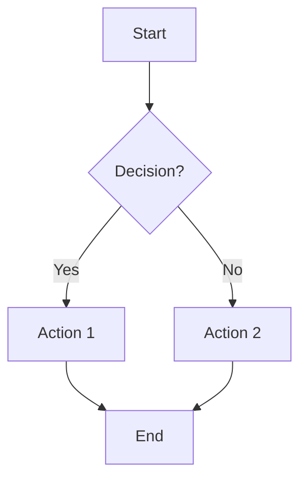

### Sequence Diagram

**Use for**: API calls, user interactions, system communication.

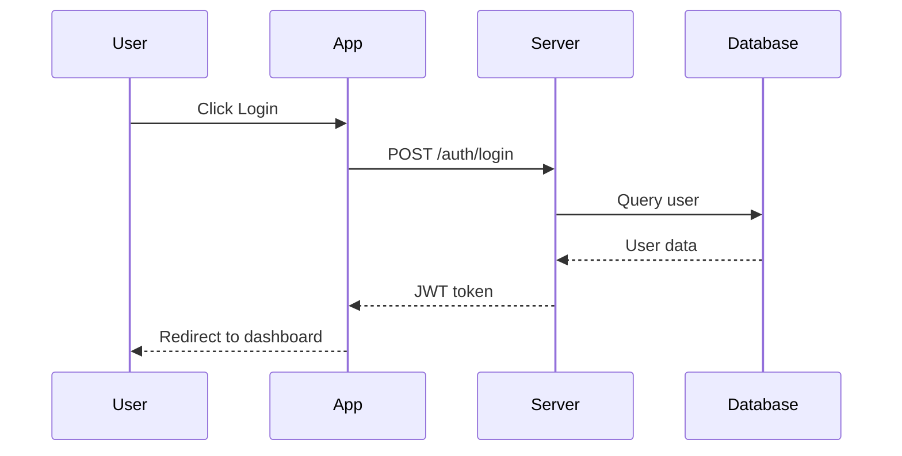

### Architecture Diagram

**Use for**: System design, infrastructure, component relationships.

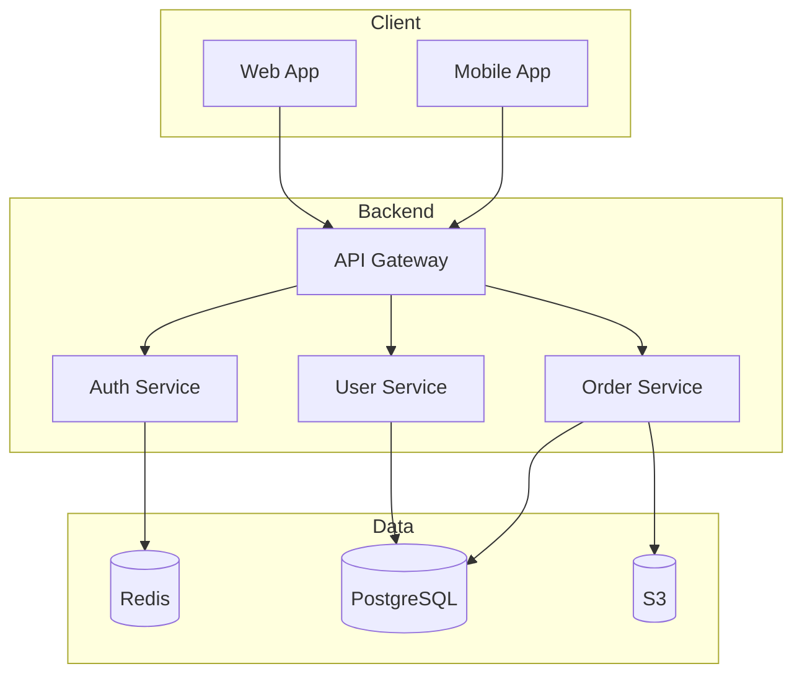

### Entity-Relationship Diagram

**Use for**: Database design, data models, wiki frontmatter schemas.

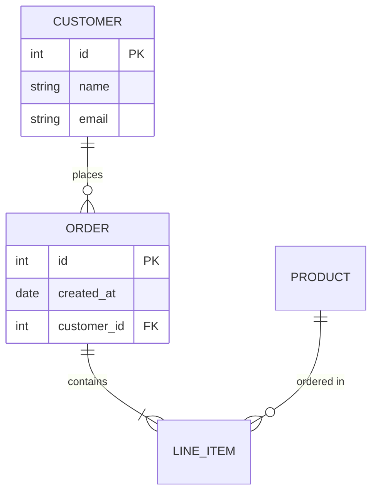

### Class Diagram

**Use for**: OOP design, code structure.

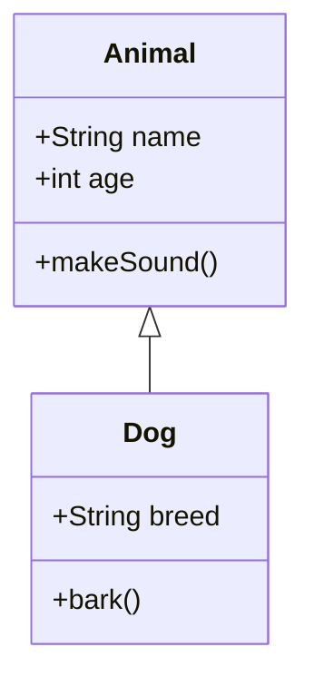

### State Diagram

**Use for**: State machines, status workflows (e.g. a page's `status:` lifecycle).

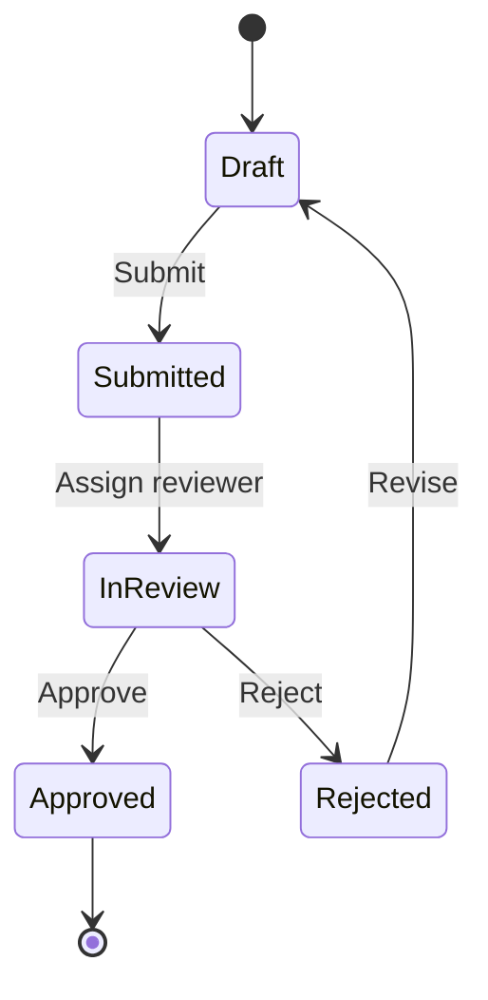

### Gantt Chart

**Use for**: Project timelines, schedules.

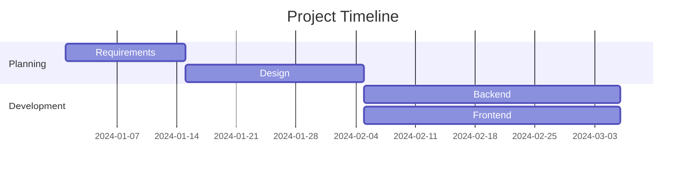

### Mind Map

**Use for**: Brainstorming, concept organization.

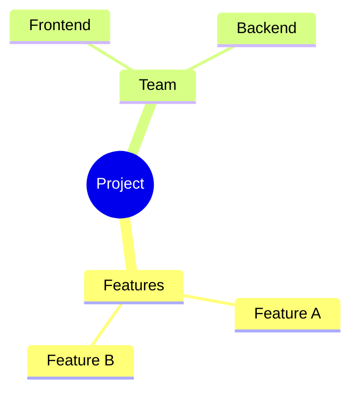

### Git Graph

**Use for**: Branch visualization, git workflows.

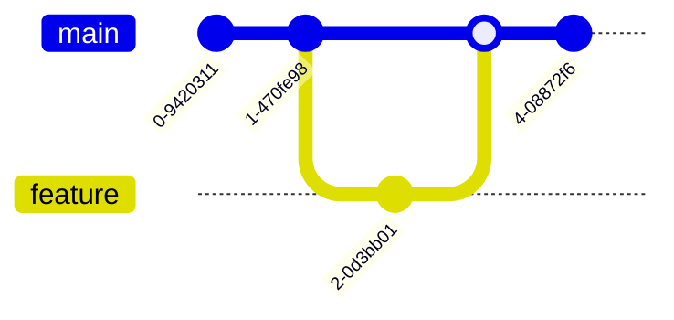

## PlantUML Examples

### Sequence Diagram (PlantUML)

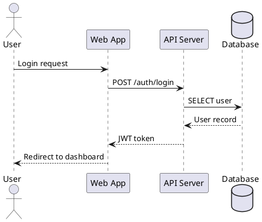

### Component Diagram

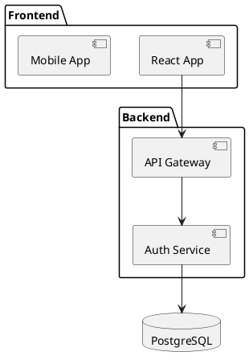

## Customization

### Color Theme

Add to the beginning of a Mermaid block:
```
%%{init: {'theme':'forest'}}%%
```
Available themes: `default`, `forest`, `dark`, `neutral`.

### Direction

`TB` (top to bottom), `BT` (bottom to top), `LR` (left to right), `RL` (right to left).

### Tips

1. Keep it simple — don't overcrowd.
2. Use consistent, descriptive naming.
3. Group related items with subgraphs/packages.
4. Match diagram type to the concept being shown.
5. Use colors sparingly, for emphasis only.
6. Maintain a top-down or left-right hierarchy.

## Rendering Tools

| Tool | URL | Best For |
|------|-----|----------|
| Mermaid Live | mermaid.live | Quick editing |
| PlantUML Server | plantuml.com | PlantUML rendering |
| GitHub | — | Paste directly in markdown files |
| VS Code | — | Mermaid extension |

**Limitations**: cannot render raster images directly; complex layouts may need manual
adjustment; some diagram types aren't supported in every renderer.
