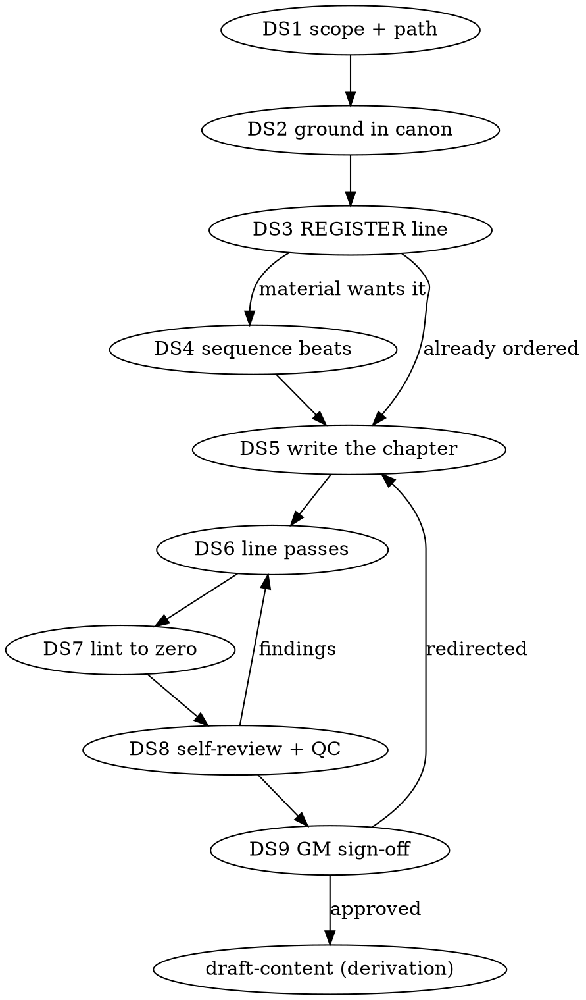

# Draft Story

Narrative-scale material is written as **one flowing chapter first**, free of
every wiki convention, and the pages are derived from it afterward. Template
structure, callouts, and DCs imposed at drafting time compete with the
creative work and weaken the story — they enter only at derivation, on the
derived page.

## The gate

Never instantiate a run guide or a `vault/` page for narrative-scale
material until its story exists on the shelf and the GM has signed off at
`DS9` -> instead: write the chapter first (a page derived from notes
instead of a story ships the summary, not the story). `vault/_templates/_stories/_story.md`
is the sole exception — its own fixed header (below) carries no wiki
convention, so instantiating it at `DS1` doesn't violate this gate.

**"This one's too small to need the checklist."** Every narrative scope runs
`DS1`–`DS9` — a single quest, one scene, a five-minute fix before Thursday.
For a small scope the chapter is three paragraphs and `DS4` is `N/A`; the
steps still run and the GM still signs off. Deadline pressure is the
condition this gate exists for, not an exemption from it. Catch yourself
reaching for one -> Read [references/red-flags.md](references/red-flags.md)
before continuing.

## The checklist

Create one todo per item and work them in order. Each ends on its emitted
tag — `DS<n>: <content, or N/A — reason>`.

| Tag | Do this |
|---|---|
| `DS1` | Name the scope and its target path. Session stories: `vault/episodes/NNN/session-NN-<slug>.md`. Other scopes: `vault/stories/<scope>-<slug>.md` (`quest-`, `season-NN-`, `arc-`, `campaign-`). A matching story already on the shelf is extended or revised, never rivalled by a second copy. A brand-new story copies `vault/_templates/_stories/_story.md`, never retyped. `DS1: <scope + path>` |
| `DS2` | Ground every established entity that will appear — the `llm-wiki-query` skill's tiered method, `llm-wiki-context-pack` for bulk, `wiki-researcher` off-thread — AND one `craft:<register>` pack render via `llm-wiki-context-pack`'s Craft packs section. The pack replaces ad-hoc reads of `vault/refs/stories/*`; `DS5`-`DS6` cite the pack, opening further craft files only for a rule the pack names but truncated. Paste the hits before the first sentence. `DS2: <entities grounded>` |
| `DS3` | Name the weight in one line before writing: `REGISTER: <what happens> -> <the weight it carries>`, per `vault/refs/stories/register.md`. Every sentence after is written at that weight. `DS3: <REGISTER line>` |
| `DS4` | Sequence into beats **only if the material wants it** — an arc, a session, a sagging middle. One beat per write, 2-3 candidates offered, the GM picks. [references/beats.md](references/beats.md). Write the shape plan: [references/shape-plan.md](references/shape-plan.md). `DS4: <beats written, or N/A — needs no sequencing> + shape plan written` |
| `DS5` | Write the chapter — prose only, one self-contained narrative. [references/hard-rules.md](references/hard-rules.md) binds. A read-aloud block, callout, DC, secret, or hazard appearing here is `docs/guardrails/PROJECT.md` PJ10/PJ12's craft — invoke it while drafting, not as an after-pass. `DS5: <path written>` |
| `DS6` | Line passes 1-3 over the finished draft, findings first, nothing applied unapproved. [references/line-passes.md](references/line-passes.md). `DS6: <pass n applied m/m>` |
| `DS7` | `npm run lint -- <story path>` driven to **zero** findings, in an earlier turn than `DS8` — the whole prose gate reaches the file through this one command (`vault/refs/runbook-commands.md` § Lint). The rewrites it forces land on the same sentences a checker scores, so a QC round opened before this is a round thrown away. Also gate on `node utils/scripts/prose-shape.mjs <story path> --profile vault/refs/stories/style-profile.json`: exit 0 required. A drift-only flag is advisory and does not block today — `vault/refs/stories/style-profile.json`'s `dm_signed_off` is `false`; the day it flips to `true`, the same flag blocks with no further edit needed here. `DS7: <0 findings, both commands>` |
| `DS8` | Self-review inline (below), then dispatch `content-quality-checker` with the `narrative-prose` profile — never in the same message as an agent still editing this story. Two rounds max; round 2 resumes the same instance via `SendMessage`, never a fresh dispatch. A piece still failing the `DS7` prose-shape gate after 2 fix rounds escalates to `/writers-room` rival drafts — mandatory, not optional, at that point. `DS8: <PASS \| findings surfaced>` |
| `DS9` | Present the story. The GM approves, redirects, or iterates. On approval, list the story's entities and facts as the derivation worklist — a synthesis of what the draft settled plus this named next step; the GM confirms before derivation begins. Never hand off silently. `DS9: <worklist> -> chain-load draft-content; next tool call is Read on its SKILL.md, no acting tool call beside it` |

### `DS8` self-review — run it yourself, never dispatch it

Before the checker sees it, read the draft cold once for: placeholders and
TBDs · a beat described instead of written ("she confronts him about the
debt") · sections that contradict each other · anything contradicting a page
pasted at `DS2` · any beat readable two ways · a charged beat sitting in a
lighter register than `DS3` named. Fix inline, then move on — no second
review.

## Entry points

Any stage is a valid entry. Start at the row that matches what the GM
brought; the steps after it still run.

| The GM brings... | Start at |
|---|---|
| A direction chosen in `colab-on-idea`, or nothing but a scope | `DS1` |
| Loose material to widen before committing — "capture this idea", "riff on this" | [references/fragments.md](references/fragments.md), then `DS1` when a shape appears |
| A fixed pile that needs ordering — "lay out the beats", "the middle sags" | `DS4` |
| A fixed pile for a single destination page that never needed a chapter — "turn these notes into prose" | [references/shaping.md](references/shaping.md), then `DS6` |
| A finished draft — "sounds like AI", "de-slop this", "pass 2" | `DS6` |

No destination `vault/` page identified yet and no scope chosen either ->
you're still in `docs/guardrails/IDEA.md`, not here. Once a scope exists,
a destination page may still not — that's normal at `DS1` for the flowing
chapter itself, not a gap to fill early (the chapter may not have a page
until `DS9`'s derivation).

## The flow

## Handoff — the terminal state

**The only skill you invoke after `DS9` is `draft-content`.** Never
instantiate a wiki-page template here, and never enter a `<type>-prep` skill
mid-draft -> instead: finish `DS9`, hand over the worklist, and let the
type-owning guide compile the story into pages (`draft-content` routes each
entity to its owner). A story reaching `DS9` with no worklist has skipped
derivation, not completed it. A finished draft targeting a ttrpg-mechanical
type (npc/location/quest/item/creature/etc.) hands off to
`docs/guardrails/CONTENT.md`; a pure narrative page (lore/recap/handout
prose) stops at `docs/guardrails/PROJECT.md` PJ15's lint/canon gate instead.

Tools reachable mid-stage, on the GM's word — none of them replaces a step:
`/writers-room` (rival drafts; its landing target is the story file) ·
`/edit-article` (restructure an existing page) · `/campaign-handoff` (end
the working session mid-task). Developmental craft is never a manual
mid-stage tool — `content-fixer` applies it unprompted on every edit.

## Rails

- **`docs/guardrails/PROJECT.md` still binds** facts/canon/lint/template-scope
  for the target file — this skill's stages add phase checks on top, never
  replace it.
- **Facts bind, style never does** (`vault/CLAUDE.md` rules 2-9: facts,
  canon, structure, visibility). Every established entity is grounded at
  `DS2`; invention fills gaps and never contradicts a pasted page. A
  deliberate retcon is flagged to the GM before drafting on it, never applied
  silently.
- **New entities are invented freely** — they become `status: pending` pages
  at derivation, not before.
- **Never flip `status:` or `publish:`** on anything — `transcript-ingest`
  and the publish proposal own those keys.
- **A timid draft is itself a violation** (`vault/CLAUDE.md` rule 10).
  Voice, structure, imagery, and risk are free. Register is not — `DS3` fixes
  the weight and every sentence matches it.
- **A death, grief, or betrayal arriving in a lighter register** — the amused
  anecdote, the flat report, workplace vocabulary — fails the
  register the same way a timid draft fails rule 10.
- **A stylistic correction lands mid-draft** -> capture it in
  `vault/refs/stories/prose-aesthetic.md` the same turn (a never-do into
  `vault/refs/stories/banned-patterns.md`), never deferred to a later editing
  pass.
- **Degrade by asking** — scope unclear, audience unset, the pile contradicts
  the wiki, or a canon conflict surfaces -> ask the specific question; never
  invent around it.

## Reference files

| File | Read when |
|---|---|
| [references/hard-rules.md](references/hard-rules.md) | `DS5` — what a story may and may not contain, the owned path and standing header. |
| [references/beats.md](references/beats.md) | `DS4` — grounding, candidate beats, where beats land when they serve a page. |
| [references/line-passes.md](references/line-passes.md) | `DS6` — the three passes, the register table, findings-first output. |
| [references/shaping.md](references/shaping.md) | Growing a fixed pile into prose block by block, for one destination page. |
| [references/fragments.md](references/fragments.md) | Capturing raw material before any shape exists; the `vault/ideas/` format. |
| [references/red-flags.md](references/red-flags.md) | You are rationalizing past the gate or a rail. |
| `vault/refs/stories/`, `vault/refs/ideas/` | Craft questions while drafting — scene grammar and character depth, genre register, villains and themes, adaptation, sandbox devices. `npm run search:craft -- query "<topic>"`. |
