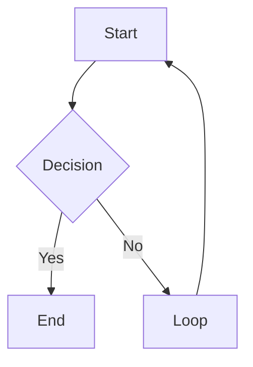

# Text Formatting, Math, Mermaid, Footnotes

## Text Formatting

| Syntax | Result |
|---|---|
| `**bold**` | Bold |
| `*italic*` | Italic |
| `~~strikethrough~~` | Strikethrough |
| `==highlight==` | Highlighted text (yellow in Obsidian) |
| `` `inline code` `` | Inline code |

---

## Math

Inline: `$E = mc^2$`

Block:
```markdown
$$
\int_0^\infty e^{-x} dx = 1
$$
```

---

## Mermaid Diagrams

Obsidian renders Mermaid natively:

````markdown

````

Supported: `graph`, `sequenceDiagram`, `gantt`, `classDiagram`, `pie`, `flowchart`.

---

## Footnotes

```markdown
This sentence has a footnote.[^1]

[^1]: The footnote text goes here.
```
